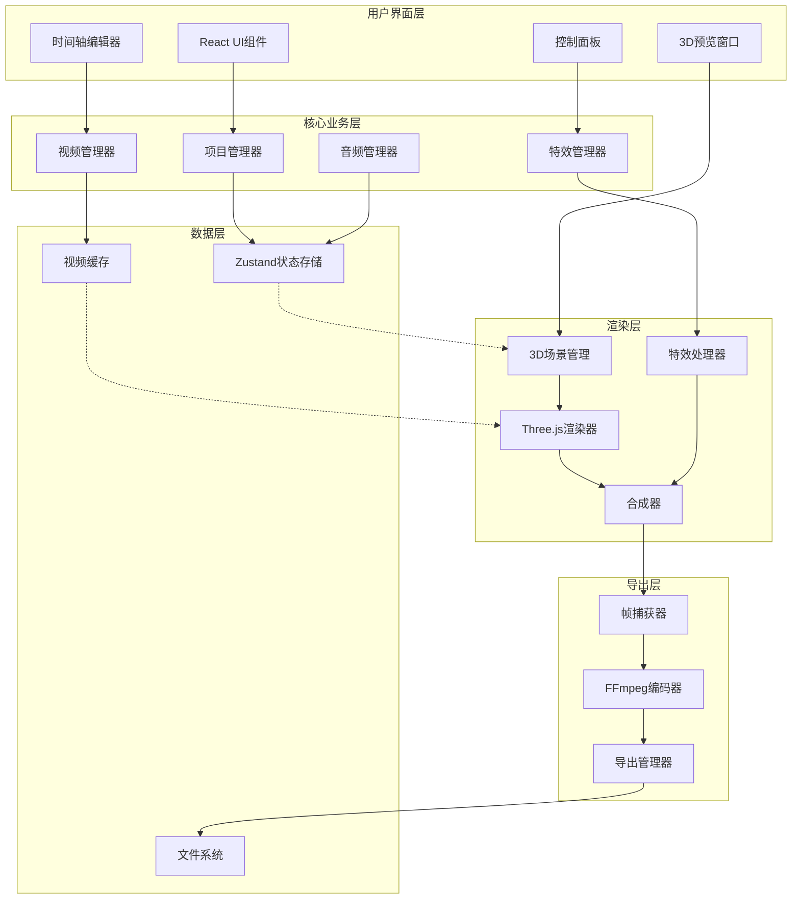

# 设计文档

## 概述

3D视频合成系统是一个基于Web的视频编辑应用，使用Three.js作为3D渲染引擎，结合WebCodecs API进行视频处理，最终通过FFmpeg.wasm实现高质量视频导出。系统采用模块化架构，分为渲染层、编辑层、导出层三个核心模块，确保高性能和可扩展性。

### 技术栈

- **前端框架**: React 18 + TypeScript
- **3D渲染**: Three.js + WebGL
- **视频处理**: WebCodecs API / Video元素
- **视频导出**: FFmpeg.wasm
- **状态管理**: Zustand
- **UI组件**: React DnD (拖拽), Framer Motion (动画)
- **音频处理**: Web Audio API
- **构建工具**: Vite

## 架构

### 系统架构图



### 数据流

1. **导入流程**: 用户选择文件 → 文件验证 → 创建Video元素 → 提取元数据 → 存入缓存 → 更新UI
2. **编辑流程**: 用户操作 → 更新状态 → 重新计算场景 → 渲染3D → 更新预览
3. **导出流程**: 触发导出 → 逐帧渲染 → 捕获帧数据 → FFmpeg编码 → 生成文件

## 组件和接口

### 1. 项目管理器 (ProjectManager)

负责项目的创建、保存、加载和状态管理。

```typescript
interface Project {
  id: string;
  name: string;
  resolution: { width: number; height: number }; // 1080x1920
  fps: number; // 30 or 60
  duration: number; // 总时长（秒）
  clips: VideoClip[];
  audioTracks: AudioTrack[];
  createdAt: Date;
  updatedAt: Date;
}

interface VideoClip {
  id: string;
  videoId: string; // 引用视频资源
  startTime: number; // 在时间轴上的开始时间
  duration: number; // 片段时长
  trimStart: number; // 视频裁剪开始
  trimEnd: number; // 视频裁剪结束
  transform: Transform3D;
  effects: Effect[];
  transition?: Transition;
}

interface Transform3D {
  position: { x: number; y: number; z: number };
  rotation: { x: number; y: number; z: number };
  scale: { x: number; y: number; z: number };
}

class ProjectManager {
  createProject(name: string): Project;
  saveProject(project: Project): Promise<void>;
  loadProject(projectId: string): Promise<Project>;
  exportProjectFile(project: Project): Blob;
  importProjectFile(file: File): Promise<Project>;
}
```

### 2. 视频管理器 (VideoManager)

管理视频资源的导入、缓存和播放控制。

```typescript
interface VideoResource {
  id: string;
  file: File;
  url: string; // Object URL
  metadata: {
    duration: number;
    width: number;
    height: number;
    fps: number;
    codec: string;
  };
  thumbnail: string; // Base64缩略图
  videoElement: HTMLVideoElement;
}

class VideoManager {
  async importVideos(files: File[]): Promise<VideoResource[]>;
  validateVideo(file: File): Promise<boolean>;
  extractMetadata(video: HTMLVideoElement): VideoMetadata;
  generateThumbnail(video: HTMLVideoElement): Promise<string>;
  getVideo(id: string): VideoResource | null;
  releaseVideo(id: string): void;
  preloadVideos(ids: string[]): Promise<void>;
}
```

### 3. 3D场景管理器 (SceneManager)

管理Three.js场景、相机、灯光和视频平面。

```typescript
class SceneManager {
  private scene: THREE.Scene;
  private camera: THREE.PerspectiveCamera;
  private renderer: THREE.WebGLRenderer;
  private videoPlanes: Map<string, VideoPlane>;
  
  initialize(canvas: HTMLCanvasElement): void;
  addVideoClip(clip: VideoClip, video: HTMLVideoElement): VideoPlane;
  removeVideoClip(clipId: string): void;
  updateClipTransform(clipId: string, transform: Transform3D): void;
  setPlaybackTime(time: number): void;
  render(): void;
  resize(width: number, height: number): void;
}

class VideoPlane {
  mesh: THREE.Mesh;
  videoTexture: THREE.VideoTexture;
  material: THREE.ShaderMaterial;
  
  updateTransform(transform: Transform3D): void;
  applyEffect(effect: Effect): void;
  setOpacity(opacity: number): void;
  dispose(): void;
}
```

### 4. 转场效果系统 (TransitionSystem)

实现各种3D转场效果。

```typescript
enum TransitionType {
  CUBE_FLIP = 'cube-flip',
  SPHERE_WARP = 'sphere-warp',
  PARTICLE_BURST = 'particle-burst',
  PAGE_TURN = 'page-turn',
  DISSOLVE = 'dissolve',
  GLITCH = 'glitch',
  ZOOM_BLUR = 'zoom-blur',
  RIPPLE = 'ripple'
}

interface Transition {
  type: TransitionType;
  duration: number; // 0.5 - 3秒
  easing: string; // 'linear', 'ease-in-out', etc.
  params: Record<string, any>; // 特定转场的参数
}

class TransitionSystem {
  applyTransition(
    fromClip: VideoPlane,
    toClip: VideoPlane,
    transition: Transition,
    progress: number // 0-1
  ): void;
  
  // 各种转场实现
  private cubeFlip(from: VideoPlane, to: VideoPlane, progress: number): void;
  private sphereWarp(from: VideoPlane, to: VideoPlane, progress: number): void;
  private particleBurst(from: VideoPlane, to: VideoPlane, progress: number): void;
  // ... 其他转场
}
```

### 5. 特效处理器 (EffectProcessor)

应用各种视觉特效和滤镜。

```typescript
enum EffectType {
  PARTICLES = 'particles',
  GLOW = 'glow',
  DISTORTION = 'distortion',
  GLITCH = 'glitch',
  CHROMATIC = 'chromatic',
  VIGNETTE = 'vignette',
  COLOR_GRADE = 'color-grade',
  BLUR = 'blur',
  PIXELATE = 'pixelate',
  RGB_SPLIT = 'rgb-split'
}

interface Effect {
  id: string;
  type: EffectType;
  intensity: number; // 0-100
  params: Record<string, any>;
  enabled: boolean;
}

class EffectProcessor {
  private composer: THREE.EffectComposer;
  private passes: Map<string, THREE.Pass>;
  
  addEffect(clipId: string, effect: Effect): void;
  removeEffect(clipId: string, effectId: string): void;
  updateEffect(clipId: string, effectId: string, params: Partial<Effect>): void;
  renderWithEffects(scene: THREE.Scene, camera: THREE.Camera): void;
}
```

### 6. 音频管理器 (AudioManager)

处理音频轨道、混音和音效。

```typescript
interface AudioTrack {
  id: string;
  type: 'video' | 'music' | 'sfx';
  source: string; // URL或视频ID
  startTime: number;
  duration: number;
  volume: number; // 0-1
  fadeIn?: number;
  fadeOut?: number;
  audioBuffer?: AudioBuffer;
}

class AudioManager {
  private audioContext: AudioContext;
  private tracks: Map<string, AudioTrack>;
  private nodes: Map<string, AudioBufferSourceNode>;
  
  async loadAudio(file: File): Promise<AudioBuffer>;
  addTrack(track: AudioTrack): void;
  removeTrack(trackId: string): void;
  setVolume(trackId: string, volume: number): void;
  play(time: number): void;
  pause(): void;
  stop(): void;
  mixTracks(): AudioBuffer; // 混合所有轨道
}
```

### 7. 导出管理器 (ExportManager)

处理视频导出和编码。

```typescript
interface ExportSettings {
  resolution: '720p' | '1080p' | '2k';
  fps: 30 | 60;
  bitrate: number; // Mbps
  format: 'mp4';
  codec: 'h264' | 'h265';
}

class ExportManager {
  private ffmpeg: FFmpeg;
  private frameCapture: FrameCapture;
  
  async initialize(): Promise<void>;
  
  async exportVideo(
    project: Project,
    settings: ExportSettings,
    onProgress: (progress: number) => void
  ): Promise<Blob>;
  
  private async renderFrame(time: number): Promise<ImageData>;
  private async encodeFrames(frames: ImageData[], audio: AudioBuffer): Promise<Blob>;
  
  cancel(): void;
}

class FrameCapture {
  captureFrame(renderer: THREE.WebGLRenderer): ImageData;
  captureSequence(
    startTime: number,
    endTime: number,
    fps: number,
    onFrame: (frame: ImageData, time: number) => void
  ): Promise<void>;
}
```

### 8. 时间轴编辑器 (TimelineEditor)

可视化时间轴UI组件。

```typescript
interface TimelineState {
  currentTime: number;
  duration: number;
  zoom: number; // 缩放级别
  playbackRate: number;
  isPlaying: boolean;
}

class TimelineEditor extends React.Component {
  // 拖拽视频片段
  onClipDrag(clipId: string, newStartTime: number): void;
  
  // 调整片段长度
  onClipResize(clipId: string, newDuration: number): void;
  
  // 添加转场
  onAddTransition(betweenClips: [string, string]): void;
  
  // 播放控制
  play(): void;
  pause(): void;
  seek(time: number): void;
  
  // 渲染时间轴
  render(): JSX.Element;
}
```

## 数据模型

### 状态管理 (Zustand Store)

```typescript
interface AppState {
  // 项目状态
  currentProject: Project | null;
  
  // 视频资源
  videos: Map<string, VideoResource>;
  
  // 时间轴状态
  timeline: TimelineState;
  
  // 选中状态
  selectedClipId: string | null;
  
  // UI状态
  ui: {
    showTimeline: boolean;
    showEffects: boolean;
    previewQuality: 'low' | 'medium' | 'high';
    isExporting: boolean;
    exportProgress: number;
  };
  
  // Actions
  setProject: (project: Project) => void;
  addVideo: (video: VideoResource) => void;
  addClip: (clip: VideoClip) => void;
  updateClip: (clipId: string, updates: Partial<VideoClip>) => void;
  removeClip: (clipId: string) => void;
  setCurrentTime: (time: number) => void;
  play: () => void;
  pause: () => void;
}
```

### 本地存储

项目文件格式 (.v3d):

```json
{
  "version": "1.0",
  "project": {
    "id": "uuid",
    "name": "我的炫酷视频",
    "resolution": { "width": 1080, "height": 1920 },
    "fps": 60,
    "clips": [...],
    "audioTracks": [...]
  },
  "videoReferences": [
    {
      "id": "video-1",
      "filename": "clip1.mp4",
      "path": "/path/to/clip1.mp4"
    }
  ]
}
```

## 错误处理

### 错误类型

```typescript
enum ErrorType {
  VIDEO_LOAD_FAILED = 'VIDEO_LOAD_FAILED',
  UNSUPPORTED_FORMAT = 'UNSUPPORTED_FORMAT',
  WEBGL_NOT_SUPPORTED = 'WEBGL_NOT_SUPPORTED',
  OUT_OF_MEMORY = 'OUT_OF_MEMORY',
  EXPORT_FAILED = 'EXPORT_FAILED',
  PROJECT_LOAD_FAILED = 'PROJECT_LOAD_FAILED'
}

class AppError extends Error {
  type: ErrorType;
  details: any;
  recoverable: boolean;
  
  constructor(type: ErrorType, message: string, details?: any) {
    super(message);
    this.type = type;
    this.details = details;
    this.recoverable = this.isRecoverable(type);
  }
  
  private isRecoverable(type: ErrorType): boolean {
    // 某些错误可以恢复
    return ![ErrorType.WEBGL_NOT_SUPPORTED].includes(type);
  }
}
```

### 错误处理策略

1. **视频加载失败**: 显示错误提示，允许用户重新选择文件
2. **WebGL不支持**: 显示降级提示，建议使用现代浏览器
3. **内存不足**: 自动降低预览质量，释放缓存，提示用户
4. **导出失败**: 保存已渲染帧，提供恢复选项
5. **项目加载失败**: 提示文件损坏，尝试恢复或创建新项目

## 测试策略

### 单元测试

- **工具类测试**: 视频验证、元数据提取、格式转换
- **状态管理测试**: Zustand store的actions和selectors
- **数学计算测试**: 3D变换、插值、缓动函数

### 集成测试

- **视频导入流程**: 从文件选择到显示在素材库
- **编辑流程**: 拖拽、变换、添加效果的完整流程
- **导出流程**: 从触发导出到生成文件

### 性能测试

- **渲染性能**: 确保60fps预览，测试不同数量的视频片段
- **内存使用**: 监控内存占用，测试长时间编辑
- **导出速度**: 测试不同分辨率和时长的导出时间

### 兼容性测试

- **浏览器**: Chrome 90+, Firefox 88+, Safari 14+, Edge 90+
- **操作系统**: Windows 10+, macOS 11+, Linux (Ubuntu 20.04+)
- **硬件**: 测试不同GPU性能的设备

## 性能优化

### 渲染优化

1. **LOD系统**: 根据视口距离调整视频质量
2. **视锥剔除**: 只渲染可见的视频片段
3. **纹理压缩**: 使用压缩纹理格式减少显存占用
4. **批处理**: 合并相同材质的绘制调用
5. **WebGL优化**: 使用VAO、UBO等高级特性

### 内存优化

1. **视频缓存策略**: LRU缓存，限制同时加载的视频数量
2. **纹理池**: 复用纹理对象
3. **及时释放**: 移除片段时立即释放资源
4. **分辨率降级**: 预览时使用较低分辨率

### 导出优化

1. **多线程**: 使用Web Workers进行编码
2. **增量渲染**: 分批渲染帧，避免阻塞UI
3. **GPU加速**: 利用WebGL进行帧处理
4. **内存流式处理**: 避免一次性加载所有帧

### 自适应性能

```typescript
class PerformanceMonitor {
  private fps: number = 60;
  private frameTime: number = 0;
  
  update(deltaTime: number): void {
    this.frameTime = deltaTime;
    this.fps = 1000 / deltaTime;
    
    if (this.fps < 30) {
      this.degradeQuality();
    } else if (this.fps > 55 && this.canUpgradeQuality()) {
      this.upgradeQuality();
    }
  }
  
  private degradeQuality(): void {
    // 降低渲染分辨率
    // 减少特效质量
    // 禁用抗锯齿
  }
  
  private upgradeQuality(): void {
    // 提升渲染质量
  }
}
```

## 部署架构

### 开发环境

```bash
npm run dev  # Vite开发服务器，支持HMR
```

### 生产构建

```bash
npm run build  # 构建优化后的静态文件
```

### 部署选项

1. **静态托管**: Vercel, Netlify, GitHub Pages
2. **CDN加速**: CloudFlare, AWS CloudFront
3. **PWA支持**: 添加Service Worker实现离线使用

### 文件结构

```
src/
├── components/          # React组件
│   ├── Timeline/       # 时间轴编辑器
│   ├── Preview/        # 3D预览窗口
│   ├── EffectsPanel/   # 特效面板
│   └── ExportDialog/   # 导出对话框
├── core/               # 核心业务逻辑
│   ├── ProjectManager.ts
│   ├── VideoManager.ts
│   ├── SceneManager.ts
│   ├── TransitionSystem.ts
│   ├── EffectProcessor.ts
│   ├── AudioManager.ts
│   └── ExportManager.ts
├── store/              # 状态管理
│   └── useAppStore.ts
├── shaders/            # GLSL着色器
│   ├── transitions/    # 转场着色器
│   └── effects/        # 特效着色器
├── utils/              # 工具函数
│   ├── validation.ts
│   ├── math.ts
│   └── format.ts
├── types/              # TypeScript类型定义
│   └── index.ts
└── App.tsx             # 主应用组件
```

## 关键技术实现

### 1. 视频纹理同步

```typescript
class VideoTexture extends THREE.VideoTexture {
  update(currentTime: number): void {
    if (this.image.currentTime !== currentTime) {
      this.image.currentTime = currentTime;
    }
    this.needsUpdate = true;
  }
}
```

### 2. 自定义着色器材质

```glsl
// 转场着色器示例 - 立方体翻转
uniform sampler2D videoA;
uniform sampler2D videoB;
uniform float progress;
uniform vec2 resolution;

void main() {
  vec2 uv = gl_FragCoord.xy / resolution;
  
  // 计算立方体翻转效果
  float angle = progress * 3.14159;
  vec2 center = vec2(0.5);
  vec2 dir = uv - center;
  float dist = length(dir);
  
  vec4 colorA = texture2D(videoA, uv);
  vec4 colorB = texture2D(videoB, uv);
  
  // 根据进度混合
  float mixer = smoothstep(0.4, 0.6, progress);
  gl_FragColor = mix(colorA, colorB, mixer);
}
```

### 3. FFmpeg.wasm集成

```typescript
async function exportWithFFmpeg(frames: ImageData[], audio: AudioBuffer): Promise<Blob> {
  const ffmpeg = createFFmpeg({ log: true });
  await ffmpeg.load();
  
  // 写入帧序列
  for (let i = 0; i < frames.length; i++) {
    const canvas = document.createElement('canvas');
    canvas.width = frames[i].width;
    canvas.height = frames[i].height;
    const ctx = canvas.getContext('2d')!;
    ctx.putImageData(frames[i], 0, 0);
    
    const blob = await new Promise<Blob>(resolve => 
      canvas.toBlob(blob => resolve(blob!), 'image/png')
    );
    const buffer = await blob.arrayBuffer();
    ffmpeg.FS('writeFile', `frame${i.toString().padStart(5, '0')}.png`, new Uint8Array(buffer));
  }
  
  // 写入音频
  const audioBlob = audioBufferToWav(audio);
  const audioBuffer = await audioBlob.arrayBuffer();
  ffmpeg.FS('writeFile', 'audio.wav', new Uint8Array(audioBuffer));
  
  // 执行FFmpeg命令
  await ffmpeg.run(
    '-framerate', '60',
    '-i', 'frame%05d.png',
    '-i', 'audio.wav',
    '-c:v', 'libx264',
    '-preset', 'medium',
    '-crf', '23',
    '-c:a', 'aac',
    '-b:a', '192k',
    '-pix_fmt', 'yuv420p',
    'output.mp4'
  );
  
  // 读取输出
  const data = ffmpeg.FS('readFile', 'output.mp4');
  return new Blob([data.buffer], { type: 'video/mp4' });
}
```

## 安全考虑

1. **文件验证**: 严格验证上传文件的MIME类型和文件头
2. **内存限制**: 限制单个视频和总项目大小
3. **XSS防护**: 对用户输入进行转义
4. **CSP策略**: 配置内容安全策略
5. **本地存储**: 敏感数据不存储在localStorage

## 未来扩展

1. **云端渲染**: 支持服务器端高性能渲染
2. **AI辅助**: 自动生成转场、智能剪辑
3. **协作编辑**: 多人实时协作
4. **模板市场**: 预设模板和特效商店
5. **移动端支持**: 响应式设计，支持触摸操作
